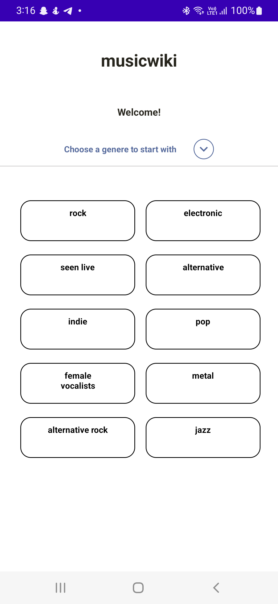
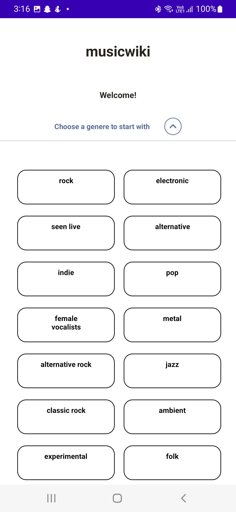
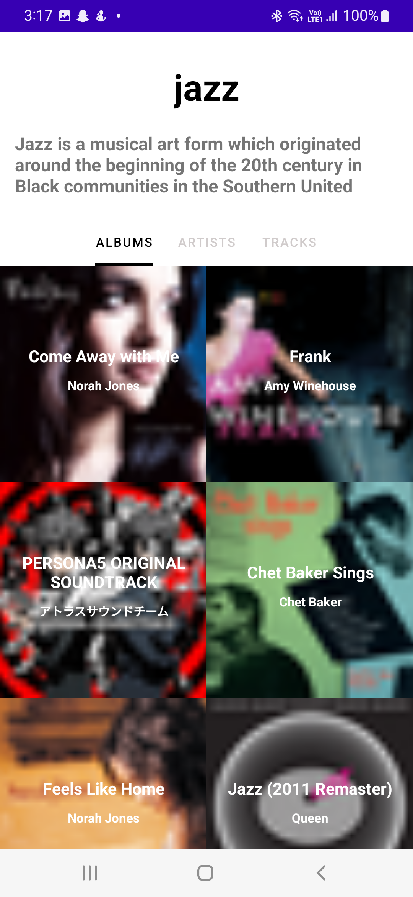
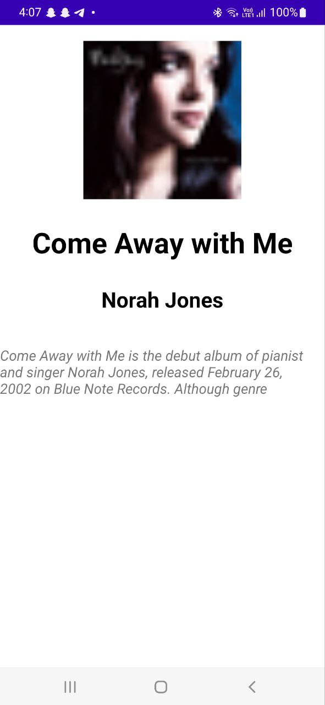
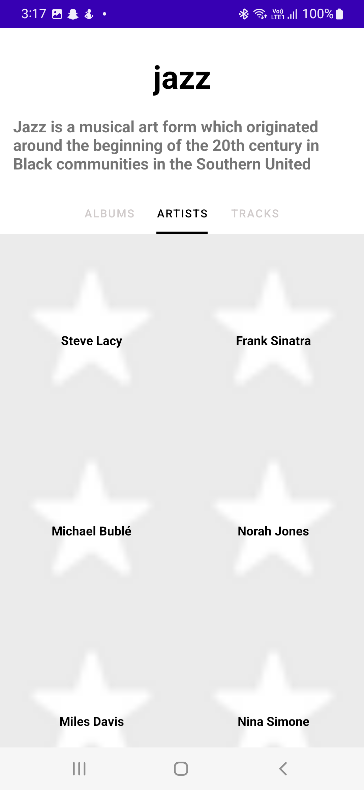
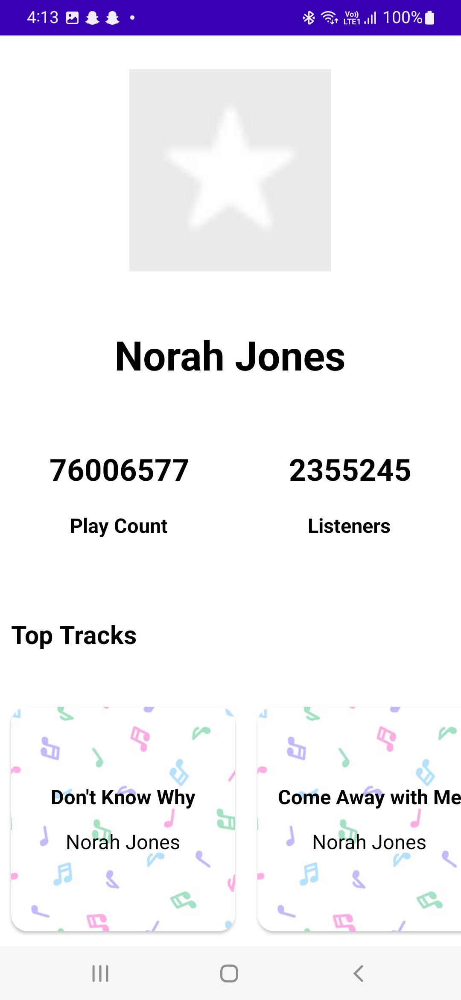
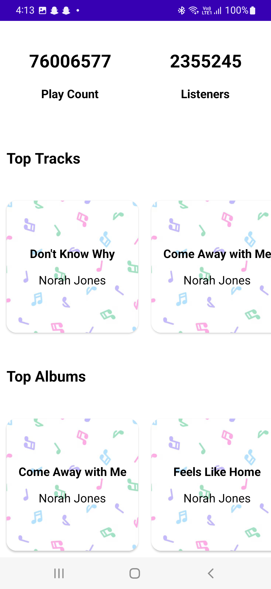
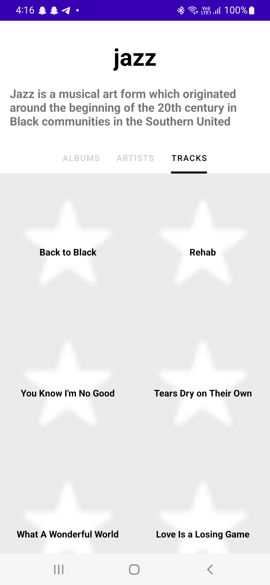

# MusicWiki App

MusicWiki is an unofficial Last.fm app that provides information about different music genres, albums, artists, and tracks listed under each genre. This app is built using the Last.fm API.

__MusicWiki is available on [Music Wiki](https://github.com/vansh-tandon/MusicWiki.git)
repo.__

## Features
* Display the list of genres available (initially top 10 genres).
* Display genre information on clicking a genre, including top albums, top tracks, and top artists.
* Display album information on clicking an album, including the cover image, title, artist information, description, and genres.
* Display artist information on clicking an artist, including the image, title, play count, followers, description, list of top tracks, list of top albums, and genres.

## Design and Implementation
The app has been designed following the guidelines mentioned in the specs for the app. I have used the Retrofit library to make API calls and the Glide library to load images. The UI has been designed using ConstraintLayout and RecyclerView.

## App Architecture
The app follows the Model-View-ViewModel (MVVM) architecture pattern. The app has three layers:

* Model layer: This layer includes the data classes for each type of data received from the API, such as Genre, Album, Track, and Artist. These classes are responsible for mapping the JSON response to Kotlin objects.
* ViewModel layer: This layer includes the classes that hold the data for each view and provide the data to the UI. They are responsible for making API calls and preparing the data to be displayed in the UI.
* View layer: This layer includes the Activities, Fragments, and Adapters that create the UI and display the data provided by the ViewModel.

## API Calls
All API calls have been implemented using the Retrofit library. The base URL for the API is https://ws.audioscrobbler.com. The API key required for the calls has been stored in the app's build.gradle file.

The following API calls have been implemented:

* tag.getTopTags: Retrieves the top 10 genres.
* tag.getInfo: Retrieves the genre information.
* tag.getTopAlbums: Retrieves the top albums for a genre.
* tag.getTopTracks: Retrieves the top tracks for a genre.
* tag.getTopArtists: Retrieves the top artists for a genre.
* album.getInfo: Retrieves the album information.
* artist.getInfo: Retrieves the artist information.

## Image Loading
All images are loaded using the Glide library. The library has been used to load the cover images for albums, artists, and tracks.

## UI
The UI has been designed to match the indicative UI provided in the specs. The UI elements have been created using ConstraintLayout and RecyclerView.
Screenshots of it can be found at the end of this README.

## Assumptions
* The app assumes that the Last.fm API key provided in the build.gradle file is valid and will not expire.
* The app assumes that the API calls will always return valid responses and handle error cases gracefully.

# Getting Started

## Prerequisites
* Android Studio
* Last.fm API key (create one at https://www.last.fm/api/account/create)
## Installation
* Clone this repository using git clone https://github.com/vansh-tandon/MusicWiki.git
* Open Android Studio and select "Open an existing Android Studio project."
* Navigate to the cloned repository and select the "build.gradle" file.
* Replace LASTFM_API_KEY with your Last.fm API key in the build.gradle file.
* Build and run the app.

## Conclusion
The MusicWiki app is an unofficial Last.fm app that provides information about different music genres, albums, artists, and tracks. The app is built using the Last.fm API and follows the MVVM architecture pattern. The app has been designed to match the indicative UI

# Screenshots

## First Screen

## First Screen (List expanded)

## Genre Details Screen - Albums

## Album Details

## Genre Details Screen - Artists

## Artist Details

## Genre Details Screen - Tracks

 
 
